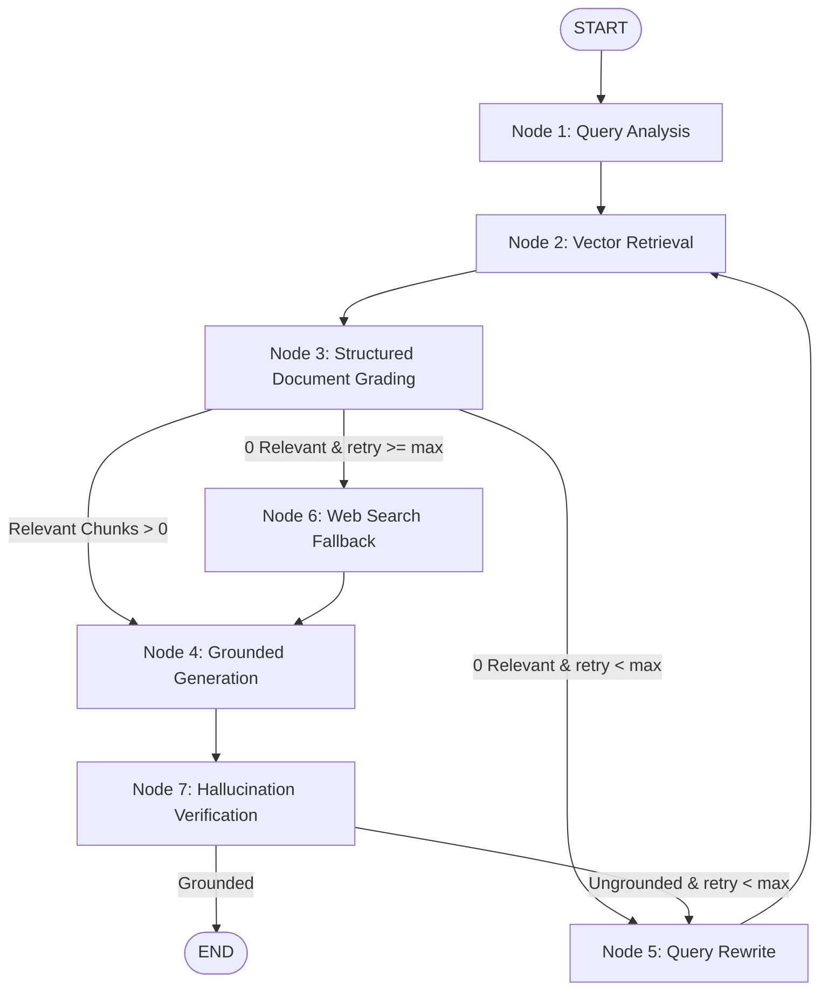

# 🤖 RAG-Based Technical Documentation Assistant

> **Express Analytics AI/ML Engineer Intern Take-Home Project**  
> *A production-grade, self-corrective Retrieval-Augmented Generation (RAG) system with dynamic query analysis, document grading, cyclic query rewriting, grounded answer generation, and interactive observability.*

[](https://www.python.org/)
[](https://fastapi.tiangolo.com/)
[](https://langchain-ai.github.io/langgraph/)
[](https://www.trychroma.com/)
[](LICENSE)

---

## 📑 Table of Contents
1. [Project Overview & Problem Statement](#1-project-overview--problem-statement)
2. [Architecture & Workflow](#2-architecture--workflow)
   - [System Architecture Diagram](#system-architecture-diagram)
   - [LangGraph StateGraph Workflow](#langgraph-stategraph-workflow)
   - [Why LangGraph Over Linear Chains](#why-langgraph-over-linear-chains)
3. [RAG Pipeline Deep Dive](#3-rag-pipeline-deep-dive)
   - [Ingestion & Hierarchical Markdown Chunking](#ingestion--hierarchical-markdown-chunking)
   - [Embedding Strategy & Multi-Provider Support](#embedding-strategy--multi-provider-support)
   - [Persistent ChromaDB Vector Store](#persistent-chromadb-vector-store)
4. [Self-Corrective RAG Mechanisms](#4-self-corrective-rag-mechanisms)
   - [Document Grading Node](#document-grading-node)
   - [Conditional Routing & Retry Budget](#conditional-routing--retry-budget)
   - [Query Rewriting & Disambiguation](#query-rewriting--disambiguation)
   - [Grounded Generation & Structured Citations](#grounded-generation--structured-citations)
   - [Self-RAG Hallucination Verification](#self-rag-hallucination-verification)
5. [FastAPI REST API Reference](#5-fastapi-rest-api-reference)
   - [Endpoint Specifications](#endpoint-specifications)
   - [Example cURL Requests & Responses](#example-curl-requests--responses)
6. [Interactive Web UI Dashboard](#6-interactive-web-ui-dashboard)
7. [Installation & Quickstart Guide](#7-installation--quickstart-guide)
8. [Automated Testing & Benchmark Evaluation](#8-automated-testing--benchmark-evaluation)
   - [The 8 Query Archetypes Benchmark](#the-8-query-archetypes-benchmark)
9. [Engineering Tradeoffs & Architectural Decisions](#9-engineering-tradeoffs--architectural-decisions)
10. [Cost Analysis & Zero-Cost Execution](#10-cost-analysis--zero-cost-execution)
11. [Limitations & Production Roadmap](#11-limitations--production-roadmap)

---

## 1. Project Overview & Problem Statement

Developers frequently struggle to extract precise, actionable answers from technical documentation. Traditional naive RAG architectures suffer from three critical failure modes:
1. **Semantic Mismatch / Poor Retrieval**: Raw user questions often lack specific API keywords, causing vector search to retrieve irrelevant chunks.
2. **Noise Pollution & Distraction**: Passing tangential chunks directly to the generator induces hallucinations or vague summaries.
3. **No Self-Correction**: If the first retrieval step fails, naive pipelines either fabricate an answer from parametric memory or crash.

### The Solution: Corrective RAG (CRAG) with LangGraph
This project implements a **Self-Corrective RAG Technical Documentation Assistant** designed to answer nuanced technical questions grounded strictly in indexed documentation (FastAPI, LangGraph, Pydantic v2, ChromaDB).

Key capabilities:
- **Intelligent Query Analysis**: Classifies question intent (`conceptual`, `how-to`, `troubleshooting`, `api_reference`) and expands technical synonyms.
- **Pydantic-Structured Document Grading**: Uses structured LLM outputs to evaluate chunk relevance and filter out noisy context.
- **Bounded Cyclic Self-Correction**: Automatically triggers targeted query reformulations when retrieval yields zero relevant documents, respecting a strict retry budget.
- **Strict Grounding & Transparent Citations**: Generates precise answers with document and section citations (`[Doc: ... | Section: ...]`).
- **Self-RAG Hallucination Verification**: Reflects upon the generated answer to confirm 100% factual faithfulness before delivery.
- **Dual Fallback Strategy**: Employs live web search (Tavily/DuckDuckGo) or graceful fallback messages when information is genuinely unavailable.

---

## 2. Architecture & Workflow

### System Architecture Diagram

```
+-----------------------------------------------------------------------------------------+
|                                     INGESTION PIPELINE                                  |
|                                                                                         |
|  +--------------------+      +-------------------------+      +----------------------+  |
|  |  Technical Corpus  | ---> |  Markdown Header Split  | ---> | Recursive Code Fence |  |
|  | (.md, .txt, .pdf,  |      |   (#, ##, ### paths)    |      |  Chunker (700 chars) |  |
|  |      URLs)         |      +-------------------------+      +----------+-----------+  |
|  +--------------------+                                                  |              |
|                                                                          v              |
|  +--------------------+      +-------------------------+      +----------------------+  |
|  | Persistent Chroma  | <--- |   Embedding Generator   | <--- |  Metadata Enrichment |  |
|  | Collection: Cosine |      | (Gemini / OpenAI / ONNX)|      |  (doc_id, section,..) |  |
|  +--------------------+      +-------------------------+      +----------------------+  |
+-----------------------------------------------------------------------------------------+

+-----------------------------------------------------------------------------------------+
|                                 FASTAPI & LANGGRAPH RUNTIME                             |
|                                                                                         |
|  +--------------------+      +-------------------------+      +----------------------+  |
|  | User / HTTP Client | ---> |   FastAPI (POST /query) | ---> | LangGraph StateGraph |  |
|  +--------------------+      +-------------------------+      +----------+-----------+  |
|                                                                          |              |
|                                    +-------------------------------------+              |
|                                    v                                                    |
|                         [ Node 1: Query Analysis ]                                      |
|                                    |                                                    |
|                                    v                                                    |
|                         [    Node 2: Retrieve    ]                                      |
|                                    |                                                    |
|                                    v                                                    |
|                         [ Node 3: Grade Documents]                                      |
|                                    |                                                    |
|                      +-------------+-------------+                                      |
|                      |                           |                                      |
|          (Relevant Chunks > 0)          (No Relevant Chunks)                            |
|                      |                           |                                      |
|                      v                           v                                      |
|            [ Node 4: Generation ]       [ Check Retry Budget ]                          |
|                      |                   /                  \                           |
|                      v          (retries < max)         (retries exhausted)             |
|            [ Node 5: Self-RAG          /                      \                         |
|             Hallucination Check]      v                        v                        |
|                      |        [ Node 6: Rewrite ]     [ Fallback / Web Search ]         |
|                      |                |                        |                        |
|                      |                +---> [ Retrieve ]       v                        |
|                      v                                  [ Graceful Fallback ]           |
|            +---------------------------------------------------+                        |
|            | Structured Response: Answer + Citations + Trace   |                        |
|            +---------------------------------------------------+                        |
+-----------------------------------------------------------------------------------------+
```

### LangGraph StateGraph Workflow

The workflow is modeled as a cyclic state machine:



### Why LangGraph Over Linear Chains
1. **Cyclic Control**: Linear DAGs (like `RunnableSequence`) cannot loop back. Self-corrective RAG requires retrying retrieval with rewritten queries when initial attempts fail.
2. **Deterministic State Mutation**: `GraphState` enforces a strict contract across nodes, passing `retrieved_documents`, `relevant_documents`, `retry_count`, and `execution_trace` without hidden state side-effects.
3. **Loop Bounding & Safety**: Prevents infinite loops by coupling conditional routing with an explicit `retry_count < max_retries` guard.
4. **Inspectability & Checkpointing**: Integrated with `MemorySaver`, allowing super-step time travel, session resumption, and full observability.

---

## 3. RAG Pipeline Deep Dive

### Ingestion & Hierarchical Markdown Chunking
Technical documentation consists of hierarchical outlines (H1, H2, H3) and intact code examples. Splitting by raw character length destroys code indentation and context.

Our two-stage chunker (`app/ingestion/chunking.py`):
1. **`MarkdownHeaderTextSplitter`**: Parses Markdown by `#`, `##`, `###`, attaching breadcrumb section paths (`FastAPI Architecture > Dependency Injection > Yield Dependencies`) into metadata.
2. **`RecursiveCharacterTextSplitter`**: Processes large subsections with code-aware separators:
   ```python
   separators = ["\n```\n", "\n```", "\n\n", "\n", " ", ""]
   ```
   Ensuring Python code fences are never cut midway through a function definition.
3. **Metadata Enrichment**: Every chunk receives `source`, `doc_title`, `section_title`, `chunk_id`, `char_length`, and ISO timestamp.

### Embedding Strategy & Multi-Provider Support
The system abstracts embeddings via `app/retrieval/embeddings.py`:
- **Default / Zero-Cost**: ChromaDB's local ONNX `all-MiniLM-L6-v2` (high-speed, local CPU inference, zero API cost).
- **Cloud Providers**: Google Gemini `models/text-embedding-004` or OpenAI `text-embedding-3-small`.

### Persistent ChromaDB Vector Store
Configured with on-disk storage (`data/chroma_db`) and **Cosine Similarity Distance**:
$$\text{Similarity Score} = \max\left(0.0, 1.0 - \text{distance}\right)$$
Supports metadata filtering, collection aggregations for `GET /documents`, and document deletions.

---

## 4. Self-Corrective RAG Mechanisms

### Document Grading Node
Rather than blindly feeding all retrieved chunks to the LLM, `grade_documents` scores each chunk using a structured Pydantic schema:

```python
class GradeChunkOutput(BaseModel):
    is_relevant: bool = Field(description="True if chunk directly answers question.")
    confidence: float = Field(ge=0.0, le=1.0, description="Confidence score.")
    reasoning: str = Field(description="Brief technical explanation.")
```

- **Relevant Chunks**: Kept in `relevant_documents`.
- **Irrelevant Chunks**: Filtered out into `filtered_out_documents`, preventing context distraction.

### Conditional Routing & Retry Budget
The conditional router `decide_to_generate`:
```python
def decide_to_generate(state: GraphState) -> str:
    if len(state["relevant_documents"]) > 0:
        return "generate"
    if state["retry_count"] < state["max_retries"]:
        return "rewrite_query"
    if settings.ENABLE_WEB_SEARCH_FALLBACK:
        return "web_search_fallback"
    return "generate"  # Triggers calibrated insufficient-information response
```

### Grounded Generation & Structured Citations
The generation prompt strictly forbids parametric speculation. Inline citations are attached:
```markdown
FastAPI supports dependency injection via `Depends()`. Sub-dependencies can be 
hierarchically nested in a DAG [Doc: fastapi_architecture.md | Section: Dependency Injection System].
```

---

## 5. FastAPI REST API Reference

### Endpoint Summary

| Method | Endpoint | Description |
| :--- | :--- | :--- |
| `POST` | `/api/v1/query` | Submits natural language question through LangGraph pipeline. |
| `POST` | `/api/v1/ingest/file` | Multipart file upload (`.md`, `.txt`, `.pdf`) for indexing. |
| `POST` | `/api/v1/ingest/url` | Scrapes, cleans, and indexes web documentation from URL. |
| `POST` | `/api/v1/ingest/text` | Direct ingestion of raw text/markdown snippet. |
| `GET` | `/api/v1/documents` | Lists all indexed documents, sections, and chunk statistics. |
| `DELETE` | `/api/v1/documents/{source}` | Deletes a document source and its embeddings from index. |
| `POST` | `/api/v1/feedback` | Records thumbs up/down user rating and comments in SQLite. |
| `GET` | `/api/v1/feedback` | Returns aggregate satisfaction metrics. |
| `GET` | `/api/v1/health` | Diagnostic health check and active LLM status. |
| `GET` | `/api/v1/graph/visualize` | Returns Mermaid workflow markdown. |
| `GET` | `/ui` | Serves interactive Web UI dashboard. |

---

### Example cURL Requests & Responses

#### 1. Ask a Question (`POST /api/v1/query`)
```bash
curl -X POST "http://localhost:8000/api/v1/query" \
     -H "Content-Type: application/json" \
     -d '{
       "query": "How do you declare query parameters in FastAPI?",
       "max_retries": 2
     }'
```

**Response:**
```json
{
  "query": "How do you declare query parameters in FastAPI?",
  "answer": "In FastAPI, query parameters are declared as function arguments that are not part of the path parameters. You can add validation such as min_length and max_length using Query(). [Doc: fastapi_architecture.md | Section: Query Parameters and Validation]",
  "citations": [
    {
      "source": "fastapi_architecture.md",
      "doc_title": "FastAPI Architecture",
      "section_title": "Query Parameters and Validation",
      "chunk_id": "fastapi_architecture.md_chunk_3_a9b1c2"
    }
  ],
  "query_type": "how-to",
  "retry_count": 0,
  "web_search_used": false,
  "is_grounded": true,
  "groundedness_score": 0.98,
  "status": "success",
  "execution_trace": [
    { "node_name": "query_analysis", "step_number": 1, "details": { "query_type": "how-to" }, "timestamp": "2026-08-20T09:00:00Z" },
    { "node_name": "retrieval", "step_number": 2, "details": { "chunks_retrieved": 4 }, "timestamp": "2026-08-20T09:00:01Z" },
    { "node_name": "document_grading", "step_number": 3, "details": { "relevant_count": 2, "filtered_count": 2 }, "timestamp": "2026-08-20T09:00:02Z" },
    { "node_name": "generation", "step_number": 4, "details": { "citations_count": 1 }, "timestamp": "2026-08-20T09:00:03Z" }
  ],
  "latency_seconds": 1.15
}
```

#### 2. Ingest Web Documentation (`POST /api/v1/ingest/url`)
```bash
curl -X POST "http://localhost:8000/api/v1/ingest/url" \
     -H "Content-Type: application/json" \
     -d '{
       "url": "https://fastapi.tiangolo.com/tutorial/first-steps/",
       "doc_title": "FastAPI First Steps"
     }'
```

#### 3. Submit Feedback (`POST /api/v1/feedback`)
```bash
curl -X POST "http://localhost:8000/api/v1/feedback" \
     -H "Content-Type: application/json" \
     -d '{
       "rating": "up",
       "query": "How do you declare query parameters?",
       "comment": "Accurate explanation and cited the correct section."
     }'
```

---

## 6. Interactive Web UI Dashboard

The assistant includes a sleek, dark-mode dashboard served directly at `http://localhost:8000/ui` or `http://localhost:8000/`:
- **Real-Time Interactive Q&A** with sample question chips.
- **Live Observability Timeline** showing step-by-step LangGraph node executions.
- **Citation Cards** displaying source files and section headings.
- **Corpus Explorer & URL Ingestor**.
- **Integrated Feedback Widget** (thumbs up/down).

---

## 7. Installation & Quickstart Guide

### Option A: Local Python Setup

```bash
# 1. Clone Repository
git clone https://github.com/vickycodeswith/customer-churn-platform.git
cd customer-churn-platform

# 2. Create Virtual Environment
python3 -m venv .venv
source .venv/bin/activate

# 3. Install Dependencies
pip install -r requirements.txt

# 4. Configure Environment Variables
cp .env.example .env
# Edit .env to add your GOOGLE_API_KEY, GROQ_API_KEY, or OPENAI_API_KEY

# 5. Bootstrap Corpus Ingestion (Auto-runs on startup, or manually run)
python scripts/ingest_corpus.py

# 6. Start FastAPI Server
uvicorn app.main:app --reload --host 0.0.0.0 --port 8000
```

Open `http://localhost:8000/ui` in your browser!

### Option B: Docker Quickstart

```bash
# Build and run container
docker-compose up --build
```

---

## 8. Automated Testing & Benchmark Evaluation

### Running Unit & Integration Tests
```bash
pytest -v
```

### The 8 Query Archetypes Benchmark
Run the automated benchmark runner:
```bash
python scripts/evaluate.py
```

| ID | Archetype | Test Query | Expected Self-Corrective Behavior |
| :---: | :--- | :--- | :--- |
| **TC-01** | Direct Factual | *"How do you declare query parameters in FastAPI?"* | Single retrieval pass $\rightarrow$ graded relevant $\rightarrow$ precise answer citing `fastapi_architecture.md`. |
| **TC-02** | Conceptual | *"What is the difference between StateGraph and standard chains in LangGraph?"* | Multi-chunk retrieval $\rightarrow$ comparative explanation of cycles and state reducers. |
| **TC-03** | How-To / Code | *"Show how to create a Pydantic v2 validator using @field_validator."* | Synthesizes clean code block grounded strictly in `pydantic_v2_core.md`. |
| **TC-04** | Multi-Chunk | *"Explain how ChromaDB persists data and computes cosine similarity."* | Synthesizes persistence configuration and distance conversion formula. |
| **TC-05** | Ambiguous | *"How do I make the route async with dependencies?"* | Query Analysis disambiguates to FastAPI `async def` and `Depends`. |
| **TC-06** | Out-of-Scope | *"What is the recipe for baking chocolate chip cookies?"* | Retrieval fails $\rightarrow$ graded irrelevant $\rightarrow$ retries exhausted $\rightarrow$ graceful fallback. |
| **TC-07** | Retry Loop | *"Explain conditional edge routing based on document grading in agent workflows."* | Triggers retrieval $\rightarrow$ grades chunks $\rightarrow$ executes bounded retry loop if needed. |
| **TC-08** | Adversarial Trap | *"Does FastAPI automatically compile Python code to Rust for 100x speedups?"* | Refutes misconception; clarifies Pydantic-core is Rust, FastAPI is Python ASGI. |

---

## 9. Engineering Tradeoffs & Architectural Decisions

### 1. ChromaDB vs. FAISS
* **Decision**: ChromaDB Persistent Client.
* **Tradeoff**: FAISS is exceptionally fast for raw vector index math in memory, but requires manual serialization of document metadata and lacks native metadata filtering (`$where`). ChromaDB provides built-in persistence, document metadata filtering, and collection management out-of-the-box with zero operational overhead.

### 2. Structured Outputs vs. Free-Form Text Parsing
* **Decision**: Pydantic models with `.with_structured_output(...)` for Grading and Query Analysis.
* **Tradeoff**: Free-form parsing (e.g. `if "yes" in text: ...`) is notoriously fragile against LLM verbosity ("Sure! The chunk is relevant..."). Structured JSON schemas enforce strict type validation and zero parse failures.

### 3. Markdown-Aware Splitting vs. Fixed Character Splitting
* **Decision**: Two-stage `MarkdownHeaderTextSplitter` + `RecursiveCharacterTextSplitter`.
* **Tradeoff**: Fixed character splitting is faster to implement, but slices code blocks and separates method signatures from parameter explanations. Markdown header splitting preserves architectural context and enables precise section citations.

### 4. Bounded Retry Limit ($N=2$)
* **Decision**: Strict cap on query rewriting retries.
* **Tradeoff**: More retries increase chance of finding elusive documents, but introduce latency and API cost. A limit of 2 balances search recovery with sub-3s response times.

---

## 10. Cost Analysis & Zero-Cost Execution

The project is explicitly architected so anyone can test it with **zero mandatory costs**:
- **Local Embeddings**: Built-in ONNX MiniLM (`EMBEDDING_PROVIDER=chroma_default`) runs 100% locally with no network calls or costs.
- **Free-Tier LLMs**: First-class support for **Google Gemini 1.5/2.0 Flash** (generous free tier) and **Groq** (free tier LLaMA-3.3).
- **Web Search Fallback**: DuckDuckGo search integration requires zero API keys and zero cost.
- **Local Testing**: Built-in mock models allow running the full pytest suite completely offline without any API keys.

---

## 11. Limitations & Production Roadmap

### Current Limitations
1. **Embedding Latency on Initial Batch**: Local ONNX embeddings download the MiniLM weights on first run (~80MB).
2. **Single-Node Vector Store**: ChromaDB is ideal for single-instance applications; multi-node clustering would require Qdrant or Milvus.

### Future Roadmap
1. **Hybrid Dense + Sparse Search**: Combine ChromaDB vector embeddings with BM25 keyword matching for exact symbol lookups.
2. **Cross-Encoder Re-Ranking**: Add FlashRank or Cohere Re-ranker after retrieval to refine the top-k chunks before LLM grading.
3. **Asynchronous Streaming**: Implement Server-Sent Events (SSE) / WebSockets for token-by-token answer streaming in the Web UI.
